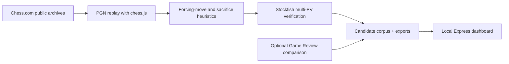

# Brilliant Scanner

**A local-first tool for finding the moves worth studying across a Chess.com game history.**

Brilliant Scanner fetches public games, replays their PGNs, narrows the search with chess-specific heuristics, and asks Stockfish to verify the strongest candidates. It also includes a resumable browser-assisted path for comparing local results with Chess.com Game Review.

## How it works



## Engineering highlights

- **Two-stage analysis:** inexpensive chess heuristics reduce the search space before deeper engine work.
- **Explainable candidates:** move records retain tactical signals such as material investment, forcing play, king pressure, and engine evaluation.
- **Resumable by design:** progress and per-player corpora are written incrementally, with atomic file replacement and retry handling for transient writes.
- **Bounded failure:** Stockfish searches use a watchdog and restart the child process instead of letting one position hang an entire scan.
- **Evaluation tooling:** scripts build labeled datasets, score detector regressions, diagnose failure buckets, tune thresholds, and train a small ranking model.
- **Separate truth sources:** local detections and optional Chess.com Review observations are stored independently so comparisons remain meaningful.

## Quick start: local PGN analysis

```bash
npm install
npm start
```

Then open [http://localhost:5050](http://localhost:5050) and enter a Chess.com username. The primary local path uses public archive data and does not require a Chess.com login.

## Optional Game Review comparison

```bash
npm run install-browser
npm run chrome
npm start
```

Log in manually in the Chrome window opened by the script, then leave that window available while the scanner runs. This path reads the visible Game Review interface; it does not use a private Chess.com API or attempt to bypass login and robot checks.

## Useful settings

| Variable | Purpose | Default |
| --- | --- | --- |
| `BRILLIANT_STOCKFISH_DEPTH` | Engine search depth | `14` |
| `BRILLIANT_STOCKFISH_MULTIPV` | Candidate lines checked per position | `8` |
| `BRILLIANT_STOCKFISH_TIMEOUT_MS` | Per-search watchdog | `12000` |
| `BRILLIANT_DELAY_MS` | Delay between review pages | `5000` |
| `BRILLIANT_REVIEW_TIMEOUT_MS` | Review-page timeout | `90000` |

## Repository map

```text
src/      scanner, state management, chess heuristics, and Stockfish integration
scripts/  corpus building, regression scoring, diagnostics, and model training
public/   local dashboard
data/     ignored runtime state plus selected reference corpora
```

## Limits and responsible use

- “Brilliant” is not a universal chess-engine label; the local detector finds evidence-backed candidates, not an official classification.
- The browser-assisted comparison is best-effort and may pause on login, CAPTCHA, rate limits, or unavailable reviews.
- The scanner is intended for personal analysis of public game archives. Use conservative request rates and respect Chess.com’s terms and service limits.
